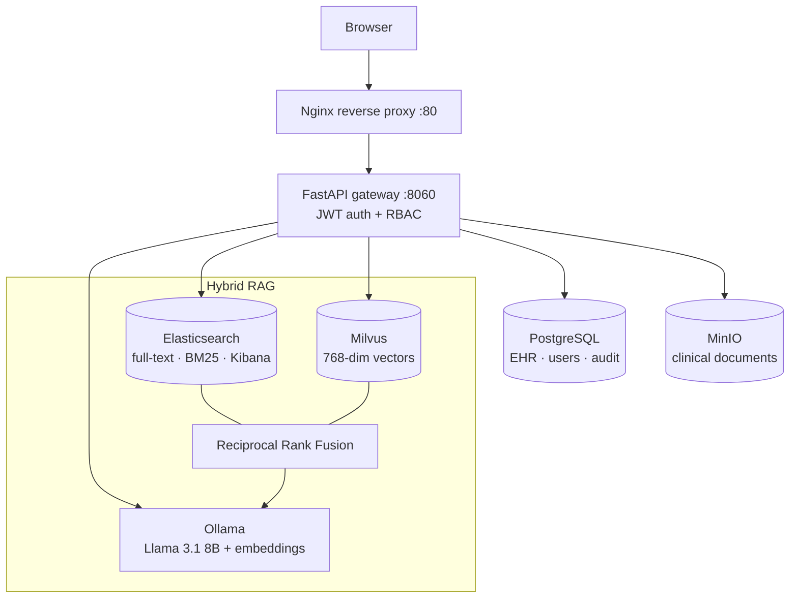

# Meditech — Clinical Information & AI Platform

A full-stack **hospital information platform** that unifies patient records, clinical workflows, and ML-assisted decision support in one system. It pairs a polyglot-persistence backend with a **hybrid retrieval-augmented-generation (RAG)** engine that answers clinical and patient questions using **citation-checked, hallucination-guarded** responses grounded in the patient's record and a curated clinical-guideline corpus.

Built as an advanced medical-informatics project (PES University, course UE26MT324), engineered to production-style patterns: containerized services, a role-based API gateway, a reverse proxy, and a one-command local setup.

---

## Highlights

- **Role-based access control** (admin / doctor / patient) enforced on every endpoint, with patients scoped to their own record.
- **Four-database polyglot persistence**, each engine matched to its job — relational EHR, full-text search, vector retrieval, and object storage.
- **Hybrid RAG**: dense (vector) + sparse (BM25) retrieval fused with **Reciprocal Rank Fusion**, grounded on a locally hosted LLM, with a guardrail that refuses rather than hallucinates.
- **FHIR R4 interoperability** — Patient, Observation, Condition, and MedicationRequest resources with real terminology codings (LOINC, ICD-10, RxNorm), REST search, and a CapabilityStatement.
- **Clinical tooling** — NEWS2 early-warning scoring, clinical decision support, an audit trail, and a **Falconer–Reich liability-threshold familial-risk model** validated against published benchmarks.
- **Document management** on object storage — clinician-authored lab/prescription/discharge documents plus patient self-uploads, all RBAC-scoped.
- **Deployment-ready** — Docker Compose for the full stack, an Nginx reverse proxy, and a public-demo path over Cloudflare Tunnel.
- **89 passing tests** covering RBAC, retrieval fusion, chunking, grounding logic, FHIR mappings, the risk model, and document routing.

---

## Architecture



**Why polyglot persistence?** Each store does what it is best at: PostgreSQL is the relational source of truth for the EHR, users, and audit log; Elasticsearch powers full-text search, BM25 retrieval, and Kibana dashboards; Milvus holds embeddings for semantic search; MinIO stores clinical files. Forcing all of this into one database would compromise every workload.

**Why hybrid RAG + RRF?** Dense retrieval captures meaning; sparse (BM25) retrieval captures exact clinical terms and codes. Reciprocal Rank Fusion merges both ranked lists so the model sees the best of each, and a grounding guardrail ensures every answer is supported by retrieved context — or honestly declines.

---

## Tech stack

| Layer | Technology |
|-------|-----------|
| API gateway | FastAPI, Uvicorn, PyJWT, bcrypt |
| Relational / EHR | PostgreSQL 15 |
| Search / analytics | Elasticsearch 8.10, Kibana |
| Vector DB | Milvus 2.6 (HNSW, cosine) |
| Object storage | MinIO (S3-compatible, boto3) |
| Data pipeline | Apache NiFi (HL7 / FHIR ingestion) |
| LLM / embeddings | Ollama — Llama 3.1 8B, nomic-embed-text |
| Interoperability | FHIR R4 (LOINC, ICD-10, RxNorm) |
| Reverse proxy | Nginx |
| Orchestration | Docker Compose |
| Frontend | Vanilla HTML / CSS / JS |
| Testing | pytest (89 tests) |

---

## Repository structure

```
.
├── docker-compose.yml          # NiFi, PostgreSQL, Elasticsearch, Kibana, MinIO, Nginx
├── init.sql                    # EHR schema + synthetic seed data
├── nginx/default.conf          # reverse-proxy config (TLS template included)
├── setup_services.py           # seeds Postgres / ES / MinIO
└── advanced/
    ├── api/                    # FastAPI gateway
    │   ├── app.py              # routes, RBAC, auth
    │   ├── fhir.py             # FHIR R4 resources + REST search
    │   ├── familial_risk.py    # Falconer liability-threshold model
    │   ├── news2.py            # early-warning score
    │   ├── minio_store.py      # document storage
    │   ├── stores.py           # Postgres / in-memory data stores
    │   └── frontend/           # portal UI
    ├── rag/                    # hybrid retrieval-augmented generation
    │   ├── retrieval.py        # dense + sparse + RRF + RBAC filtering
    │   ├── rag.py              # prompt build, grounding guardrail
    │   ├── chunking.py         # structure → semantic → recursive chunker
    │   ├── guidelines.py       # clinical-guideline corpus + EHR interpretation
    │   ├── clients.py          # Ollama / Milvus / ES clients
    │   └── ingest.py           # embed + load corpus
    └── tests/                  # 89 pytest cases
```

---

## Getting started

### Prerequisites
- Docker Desktop (with WSL2 on Windows)
- Python 3.11
- [Ollama](https://ollama.com) with models pulled:
  ```bash
  ollama pull llama3.1:8b
  ollama pull nomic-embed-text
  ```

### Setup
```bash
# 1. start the core stack
docker compose up -d

# 2. start the vector database
cd advanced/rag && docker compose -f milvus-compose.yml up -d && cd ../..

# 3. python environment
cd advanced
python -m venv .venv
source .venv/bin/activate            # Windows: .venv\Scripts\activate
pip install -r requirements-advanced.txt

# 4. seed data + build the RAG index
python ../setup_services.py
cd rag && python ingest.py && cd ..

# 5. launch the gateway
./run_postgres.sh                    # Windows: .\run_postgres.ps1
```

Open **http://localhost:8060** (direct) or **http://localhost/** (through Nginx).

> A macOS setup guide (`advanced/MAC_SETUP.md`) and a cold-start runbook are included.

### Demo credentials
> ⚠️ **These are throwaway credentials for the local demo only.** This is a teaching/portfolio project; the demo passwords in `docker-compose.yml` and the seed data are intentionally simple and are **not** intended for any real deployment. Do not reuse them.

| Role | Username | Password |
|------|----------|----------|
| Admin | `admin` | `admin123` |
| Doctor | `dr.sharma` | `doctor123` |
| Patient | `rajan` | `patient123` |

---

## Testing
```bash
cd advanced
pytest -q
```

The suite is dependency-injected so the grounding logic, RBAC, RRF, chunking, FHIR mappings, and the risk model are all testable without live services running.

---

## Design decisions worth a look

- **Grounding over fluency.** The RAG layer verifies citations and will return "not in the records" rather than fabricate clinical content — trustworthiness is the priority for a medical tool.
- **Reference-range interpretation in the corpus.** Because PostgreSQL stores raw observation values without abnormality flags, the system computes high/low/normal against reference ranges at index time, so patient questions like "what do my results mean?" ground on real interpretation.
- **Statistical genetics, done properly.** The familial-risk feature uses the Falconer–Reich liability-threshold model (pure-Python normal pdf/cdf/ppf) and is validated against a published heritability benchmark, rather than a naive multiplicative heuristic.
- **A real serving path.** Nginx fronts the gateway with production headers, gzip, upload limits, and a long timeout for LLM responses, plus a TLS template — the first step toward an actual deployment.

---

## Disclaimer
This is an academic and portfolio project for educational purposes. It is **not** a medical device, contains only **synthetic** patient data, and must not be used for clinical decision-making.

---

## Author
**Adyanth** — B.Tech (AI/ML), PES University · Medical Informatics (UE26MT324)
